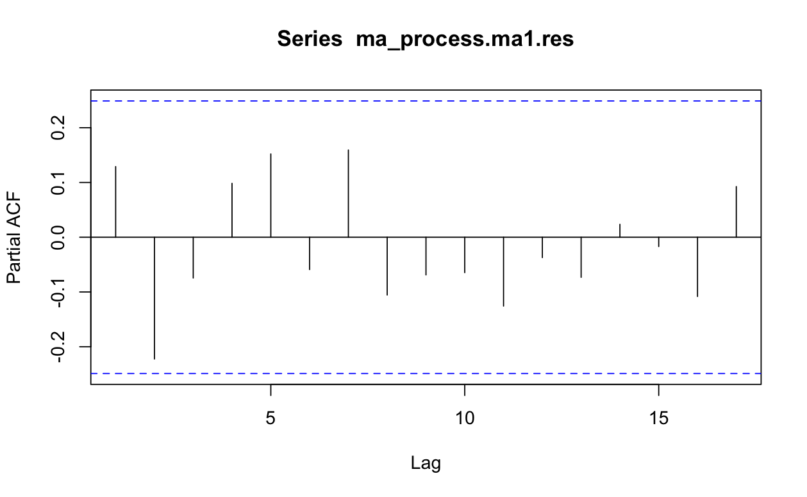
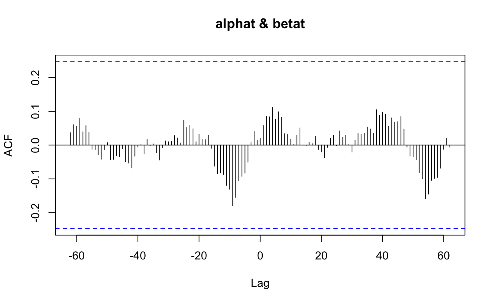

# Singapore Temperature Forecasting using Time Series Models

**Author**: Sally Marcellina Yeo  


## Overview

This project provides a detailed analysis and forecasting of Singapore's maximum daily temperatures using several time series models. The analysis spans from 1960 to 2022, and forecasts are made for the next 10 years (2023-2032).
The analysis is contained in the file `forecastingECA.Rmd`
The data used can be found in the link <a href="https://github.com/sallyyeo/Forecasting557/blob/main/Submission/SG_Enviroment_TemperatureRainfall.csv"> SG Environment Temperature and Rainfall </a>.


Key models used include:
- **Holt's Linear Trend Method**: Captures linear trends in temperature over time.
- **Linear Regression**: Predicts future temperatures based on historical trends.
- **ARIMA**: Used to handle non-stationary data through differencing and log transformations.
- **ARIMAX**: A dynamic regression model used to incorporate exogenous variables such as rainfall for more accurate predictions.

## Key Features

- **Data Cleaning**: Reshaping and transforming the raw data to prepare it for time series analysis.
- **Time Series Exploration**: Analyzing the trends, autocorrelations, and stationarity of the time series data.
- **Model Evaluation**: Evaluating the performance of different models using metrics such as MAPE, MAD, MSD, and AIC.
- **Forecasting**: Forecasting future temperatures using the best-performing models.

## Results

The project evaluates the following models:

| Model                 | MAPE     | MAD      | MSD      | AIC     |
|-----------------------|----------|----------|----------|---------|
| Holt’s Linear Trend    | 0.846    | 0.265    | 0.107    | 130.05  |
| Linear Regression      | 0.812    | 0.254    | 0.108    | 44.37   |
| ARIMA MA(1)            | 0.843    | 0.265    | 0.109    | 44.15   |
| ARIMAX(0,1,1)          | -        | -        | -        | 24.62   |

Among the evaluated models, **Linear Regression** and **ARIMA MA(1)** demonstrated the best overall performance in terms of accuracy. The dynamic regression model (ARIMAX) also provided good results when incorporating rainfall as an exogenous variable.

# R Code Explanation

Following are the required library:

# Requirements

```{r}
library(tidyverse)
library(forecast)
library(tsibble)
library(ggplot2)
library(tseries)
library(car)
library(TSA)
library(forecast)
```

# Loading Data

```{r}
# Clear all variables
rm(list=ls())  

# Set your working directory
setwd("/Users/sallyyeo/Desktop/557ECA")

# Read the dataset
raw <- read.csv("SG_Enviroment_TemperatureRainfall.csv")
```

# Shaping Data

```{r}
# Reshape the data using pivot_longer and pivot_wider
long_data <- raw %>%
  pivot_longer(cols = starts_with("X"), names_to = "Year", values_to = "Value")

wide_data <- long_data %>%
  pivot_wider(names_from = Data.Series, values_from = Value)

# Remove 'X' from the Year column and convert to numeric
wide_data$Year <- sub("X", "", wide_data$Year)
wide_data <- wide_data %>%
  mutate_all(function(x) {
    x <- gsub(",", "", x)  # Remove commas
    parse_number(x, na = "na")  # Set empty values to NA
  })

# Convert year to date type
wide_data$Year <- as.Date(paste(wide_data$Year, "-01-01", sep=""), format="%Y-%m-%d")

# Ensure the data is in ascending chronological order
wide_data <- wide_data[order(wide_data$Year), ]

# Display the data
print(wide_data, n=63)
```

# Time-Series Preparation

```{r}
# Load additional required libraries
library(forecast)
library(tsibble)
library(ggplot2)

# Convert 'Air Temperature Means Daily Maximum' to a ts object
temp_max_ts <- ts(wide_data$`Air Temperature Means Daily Maximum (Degree Celsius)`, 
                  start = min(year(wide_data$Year)), 
                  end = max(year(wide_data$Year)), 
                  frequency = 1)  # Yearly data

# Display the time-series
print(temp_max_ts)

# Create a data frame with years and temperature values
years <- seq(1960, 2022)  # Sequence from start year to end year
temp_max_df <- data.frame(year = years, temp = temp_max_ts)
```

Output:


# Time-Series Plotting

``` {r}
# Plot the time series
plot(temp_max_ts, xlab = "Year", ylab = "Temperature (°C)", 
     main = "Annual Average Maximum Temperature in Singapore")

# Linear regression model
time_index <- time(temp_max_ts)
temp_max_trend_model <- lm(temp_max_ts ~ time_index)
summary(temp_max_trend_model)

# Plot the original time series and the trend
plot(temp_max_ts, xlab = "Year", ylab = "Temperature (°C)",
     main = "Annual Average Maximum Temperature and Trend in Singapore")
abline(a = temp_max_trend_model$coefficients[1], b = temp_max_trend_model$coefficients[2], col = "red")
legend("topleft", legend = c("Original", "Trend"), col = c("black", "red"), lty = 1)
```

Output:

 | 

# Holt's Linear Trend Method

``` {r}
# Set forecast length
fc_length <- 10

# Apply Holt's linear trend method
temp_max_ts.desm <- holt(temp_max_ts, h = fc_length)

# Create a combined time series with forecasted values
temp_max_ts.desm_fc <- ts(c(temp_max_ts.desm$fitted, temp_max_ts.desm$mean), 
                          start = c(1960, 1), frequency = 1)

# Plot the original data and Holt's forecast
x_val <- time(temp_max_ts.desm_fc)
y_val <- c(wide_data$`Air Temperature Means Daily Maximum (Degree Celsius)`, rep(NA, fc_length))

plot(x = x_val, y = y_val, type = "l", xlab = "Year", ylab = "Temperature (°C)", lwd = 2, 
     main = "Annual Average Maximum Temperature and Trend in Singapore")
lines(x = x_val, y = temp_max_ts.desm_fc, col = "red", lwd = 3, type = "l")
legend("topleft", legend = c("Original", "Holt's"), col = c("black", "red"), lty = 1)
```

Output:


# Model Evaluation - Holt's Method

``` {r}
# Compute evaluation metrics for Holt's model
MAPE_holt <- mean(abs(temp_max_ts.desm$residuals) / wide_data$`Air Temperature Means Daily Maximum (Degree Celsius)`) * 100
MAD_holt <- mean(abs(temp_max_ts.desm$residuals))
MSD_holt <- mean(temp_max_ts.desm$residuals ^ 2)
AIC_holt <- temp_max_ts.desm$model$aic

# Display metrics
print(paste("MAPE_holt:", MAPE_holt))
print(paste("MAD_holt:", MAD_holt))
print(paste("MSD_holt:", MSD_holt))
print(paste("AIC_holt:", AIC_holt))
```

Output:

```plaintext
[1] "MAPE_holt: 0.845606672437578"
[1] "MAD_holt: 0.265236023309835"
[1] "MSD_holt: 0.10671831495861"
[1] "AIC_holt: 130.051051125273"
```

# Linear Regression Analysis

``` {r}
# Linear regression model
linear_model <- lm(temp ~ year, data = temp_max_df)
summary(linear_model)

# Forecast future values
all_years <- data.frame(year = c(1960:2022, 2023:2032))
temp_max_df.linear_fc <- predict(linear_model, newdata = all_years)
all_years$temp <- temp_max_df.linear_fc

# Convert to time series object
temp_max_ts.linear_fc <- ts(temp_max_df.linear_fc, start = 1960, end = 2032, frequency = 1)
# Print the forecasted values
print(temp_max_ts.linear_fc)

# Get the extended time periods & append the exact number of NA as the forecast length
x_val <- time(temp_max_ts.linear_fc)
y_val <- c(temp_max_df$temp, rep(NA, fc_length))

# Plot the forecasted and original data
plot(x = time(temp_max_ts.linear_fc), y = c(temp_max_df$temp, rep(NA, fc_length)), type = "l", 
     xlab = "Year", ylab = "Temperature (°C)", lwd = 2, 
     main = "Annual Average Maximum Temperature and Trend in Singapore")
abline(linear_model, col = "green")
lines(x = time(temp_max_ts.linear_fc), y = temp_max_ts.linear_fc, col = "red", lty = 1, type = "l")
legend("topleft", legend = c("Original", "Linear Regression", "Forecasted Value"), 
       col = c("black", "green", "red"), lty = 1)
```

Linear Regression forecast:


# Linear Model Evaluation

```{r}
################# Linear Model Evaluation #######################
anova(linear_model)

# Extract the residuals of the linear regression
linear_model.res <- residuals(linear_model)

# Create a qq-plot for the model residuals
qqnorm(y = linear_model.res)

# Add a 45-degree line to it. If the residuals are lying closely on the line, the residuals
# of the linear regression are most likely normally distributed.
qqline(linear_model.res, col = "red")

# Generate a histogram to have another check on the distribution of the residuals
hist(linear_model.res, breaks = 8)

# The result should be supported by a numerical test. 
# The Shapiro-Wilk test is most common for it.
shapiro.test(linear_model.res)

# Check on the independence of the residuals by looking at the ACF
acf(linear_model.res, lag.max = 63)

#install.packages("car")
library(car)
durbinWatsonTest(linear_model)

# Calculating predicted values for the actual period (1960-2022)
temp_max_df$predicted_temp <- predict(linear_model, newdata = temp_max_df)

# Calculating MAPE
MAPE_lm <- mean(abs((temp_max_df$temp - temp_max_df$predicted_temp) / temp_max_df$temp)) * 100

# Calculating MAD
MAD_lm <- mean(abs(temp_max_df$temp - temp_max_df$predicted_temp))

# Calculating MSD
MSD_lm <- mean((temp_max_df$temp - temp_max_df$predicted_temp)^2)

# Extracting AIC
AIC_lm <- AIC(linear_model)

# Print the metrics
print(paste("MAPE:", MAPE_lm))
print(paste("MAD:", MAD_lm))
print(paste("MSD:", MSD_lm))
print(paste("AIC:", AIC_lm))
```

Output:

```plaintext
Analysis of Variance Table

Response: temp
          Df Sum Sq Mean Sq F value    Pr(>F)    
year       1 6.6214  6.6214   59.55 1.351e-10 ***
Residuals 61 6.7827  0.1112                      
---
Signif. codes:  0 ‘***’ 0.001 ‘**’ 0.01 ‘*’ 0.05 ‘.’ 0.1 ‘ ’ 1

	Shapiro-Wilk normality test

data:  linear_model.res
W = 0.97428, p-value = 0.2093

 lag Autocorrelation D-W Statistic p-value
   1        0.312369      1.362993   0.006
 Alternative hypothesis: rho != 0
[1] "MAPE: 0.811967714365999"
[1] "MAD: 0.254445846438931"
[1] "MSD: 0.107661605263372"
[1] "AIC: 44.3742330891586"
```

Residual Analysis:


# Data Preparation for ARIMA

``` {r}
# First differencing
temp_max_ts_diff1 <- diff(temp_max_df$temp, lag = 1)

# Check variance
plot(temp_max_ts_diff1)
plot(x = 1:62, y = temp_max_ts_diff1)

# Check stationarity with ACF
acf(temp_max_ts_diff1, lag.max=62)
pacf(temp_max_ts_diff1, lag.max=62)
```

Variance, ACF and PACF of first differencing:


Performing Log Transformation:

```{r}
# Log transformation
temp_max_ts_log <- log(temp_max_df$temp, base = exp(1))

# Check variance
plot(x = wide_data$Year, y = temp_max_ts_log)

# Check stationarity with ACF
acf(temp_max_ts_log)
pacf(temp_max_ts_log)
```

Variance, ACF and PACF of log transformed:


 


```{r}
# Differencing the log transformed
temp_max_ts_log_diff1 <- diff(temp_max_ts_log, lag = 1)

# Check variance
plot(temp_max_ts_log_diff1)
plot(x = 1:62, y = temp_max_ts_log_diff1)

# Check stationarity with ACF
acf(temp_max_ts_log_diff1, lag.max = 63)
pacf(temp_max_ts_log_diff1, lag.max = 63)
```

Variance, ACF and PACF of log and diff1 transformed:


```{r}
# MA(1) after diff the log transformed
ma_process.ma1 <- arima(temp_max_ts_log_diff1, order = c(0, 0, 1))
print(ma_process.ma1)

# Find p-value of the MA(1)
param_ma1 <- ma_process.ma1$coef
covmat_ma1 <- ma_process.ma1$var.coef
se_ma1 <- sqrt(diag(covmat_ma1))
ttest_ma1 <- abs(param_ma1) / se_ma1
pt(ttest_ma1, df = length(ma_process.ma1) - length(param_ma1), lower.tail = FALSE) * 2
summary(ma_process.ma1)

# MA(2) after diff the log transformed
ma_process.ma2 <- arima(temp_max_ts_log_diff1, order = c(0, 0, 2))
print(ma_process.ma2)

# Find p-value of the MA(2)
param_ma2 <- ma_process.ma2$coef
covmat_ma2 <- ma_process.ma2$var.coef
se_ma2 <- sqrt(diag(covmat_ma2))
ttest_ma2 <- abs(param_ma2) / se_ma2
pt(ttest_ma2, df = length(ma_process.ma2) - length(param_ma2), lower.tail = FALSE) * 2
summary(ma_process.ma2)
```

Model evaluation:

```plaintext
Shapiro-Wilk normality test

data:  ma_process.ma1.res
W = 0.98073, p-value = 0.4378


Call:
arima(x = temp_max_df$temp, order = c(0, 1, 1))

Coefficients:
         ma1
      -0.712
s.e.   0.089

sigma^2 estimated as 0.1106:  log likelihood = -20.07,  aic = 42.15
```

```{r}
########## Model Diagnostic ##########
# Extract the residuals of the model MA(1)
ma_process.ma1.res <- residuals(ma_process.ma1)
acf(ma_process.ma1.res)
pacf(ma_process.ma1.res)

# Check model's normality
hist(ma_process.ma1.res)
qqnorm(ma_process.ma1.res)
qqline(ma_process.ma1.res, col = "red")
shapiro.test(ma_process.ma1.res)

# Accuracy metrics
arima011 <- arima(temp_max_df$temp, order = c(0, 1, 1))
summary(arima011)
```

ACF, PACF and QQ of MA1:

 | 

 | 


# ARIMA MODEL

``` {r}
# Forecast using MA(1)
fc_length = 10
ma1_fc = predict(ma_process.ma1, n.ahead = fc_length)

# Reverse the differencing
fcval <- c(temp_max_ts_log_diff1, ma1_fc$pred) # Combine historical & forecasted
fcval <- ts(fcval, start = c(1960), frequency = 1)

# Reverse the log transformation
newval <- c(temp_max_ts_log[1], temp_max_ts_log[1] + cumsum(fcval))
newval <- ts(newval, start = c(1960), frequency = 1)
ma1_original_scale_fc = exp(newval)

# Print forecast in original scale
print(ma1_original_scale_fc)

# Compare forecast with mean of historical data
mean(temp_max_df$temp)

# Plot the forecast values
plot(ma1_original_scale_fc, type = "l", col = "red")
lines(temp_max_df$temp, col = "black")
legend("topleft", legend = c("Original", "ARIMA(0,0,1)"), col = c("black", "red"), lty = 1)
```

ARIMA forecast:

![assets/img/arima.png]

# Data Preparation for ARIMAX

``` {r}
# Convert 'Air Temperature Means Daily Maximum (Degree Celsius)' to a ts object
temp_max_ts <- ts(wide_data$`Air Temperature Means Daily Maximum (Degree Celsius)`, 
                  start = min(year(wide_data$Year)), 
                  end = max(year(wide_data$Year)), 
                  frequency = 1) # Since the data is yearly, frequency is 1

# Convert 'Air Temperature Means Daily Maximum (Degree Celsius)' to a ts object
rainfall_ts <- ts(wide_data$`Total Rainfall (Millimetre)`, 
                  start = min(year(wide_data$Year)), 
                  end = max(year(wide_data$Year)), 
                  frequency = 1) # Since the data is yearly, frequency is 1

# Adding new column total_rainfall to the temp_max_df created in Q1
temp_max_df %>% mutate(total_rainfall = rainfall_ts) -> temp_rainfall_df
```

# Data Stationary Check

```{r}
# Check stationarity for the maximum temperature time series
adf_test_temp = adf.test(temp_max_ts, alternative = "stationary")
print(adf_test_temp) # non-stationary

# Check stationarity for the rainfall time series
adf_test_rainfall = adf.test(rainfall_ts, alternative = "stationary")
print(adf_test_rainfall) # stationary
```

Output:

```plaintext
Augmented Dickey-Fuller Test

data:  temp_max_ts
Dickey-Fuller = -2.7852, Lag order = 3, p-value = 0.2569
alternative hypothesis: stationary


	Augmented Dickey-Fuller Test

data:  rainfall_ts
Dickey-Fuller = -4.6793, Lag order = 3, p-value = 0.01
alternative hypothesis: stationary
```

# ACF and PACF of Rainfall and Temperature

```{r}
# Check ACF and PACF
rainfall_acf <- acf(rainfall_ts, lag.max = 63)
rainfall_pacf <- pacf(rainfall_ts, lag.max= 63)
temp_acf <- acf(temp_max_ts, lag.max= 63)
temp_pacf <- pacf(temp_max_ts, lag.max= 63)
```

Ouput:

 | 

 | 

# Scatter Plot

```{r}
# Create a combined data frame
years <- seq(1960, 2022)
data_df <- data.frame(year = years,
                      temperature = as.numeric(temp_max_ts),
                      rainfall = as.numeric(rainfall_ts))

# Scatter plot of temperature vs. rainfall
plot(data_df$rainfall, data_df$temperature, xlab = "Rainfall (mm)", ylab = "Temperature (°C)", main = "Temperature vs. Rainfall")
abline(lm(temperature ~ rainfall, data = data_df), col = "blue")  # Adds a regression line
```

Scatter Plot Output:


# Data Pre-Whitening for ARIMAX using ARIMA

``` {r}
###### TESTING ARIMA MODEL for PRE-WHITENING ######
# For dynamic regression, we must first prewhiten both the series using the suitable ARIMA model for rainfall_ts
rainfall.arima101 <- arima(rainfall_ts, order = c(1, 0, 1))
print(rainfall.arima101)
param <- rainfall.arima101$coef # Extract coefficient estimates
se <- sqrt(diag(rainfall.arima101$var.coef)) # Extract standard errors of the coefficient estimates
degree_freedom <- rainfall.arima101$nobs - length(param) # Degrees of freedom
pt(abs(param) / se, df = degree_freedom, lower.tail = FALSE) * 2 # Compute p-values

# For dynamic regression, we must first prewhiten both the series using the suitable ARIMA model for rainfall_ts
rainfall.arima201 <- arima(rainfall_ts, order = c(2, 0, 1))
print(rainfall.arima201)
param <- rainfall.arima201$coef # Extract coefficient estimates
se <- sqrt(diag(rainfall.arima201$var.coef)) # Extract standard errors of the coefficient estimates
degree_freedom <- rainfall.arima201$nobs - length(param) # Degrees of freedom
pt(abs(param) / se, df = degree_freedom, lower.tail = FALSE) * 2 # Compute p-values

# For dynamic regression, we must first prewhiten both the series using the suitable ARIMA model for rainfall_ts
rainfall.arima102 <- arima(rainfall_ts, order = c(1, 0, 2))
print(rainfall.arima102)
param <- rainfall.arima102$coef # Extract coefficient estimates
se <- sqrt(diag(rainfall.arima102$var.coef)) # Extract standard errors of the coefficient estimates
degree_freedom <- rainfall.arima102$nobs - length(param) # Degrees of freedom
pt(abs(param) / se, df = degree_freedom, lower.tail = FALSE) * 2 # Compute p-values

# For dynamic regression, we must first prewhiten both the series using the suitable ARIMA model for xt
rainfall.arima111 <- arima(rainfall_ts, order = c(1, 1, 1))
print(rainfall.arima111)
param <- rainfall.arima111$coef # Extract coefficient estimates
se <- sqrt(diag(rainfall.arima111$var.coef)) # Extract standard errors of the coefficient estimates
degree_freedom <- rainfall.arima111$nobs - length(param) # Degrees of freedom
pt(abs(param) / se, df = degree_freedom, lower.tail = FALSE) * 2 # Compute p-values

# Take the residuals of the model for rainfall_ts as the prewhitened series of rainfall_ts
alphat <- resid(rainfall.arima101)
print(alphat)
```

Output of pre-whitening process:

```plaintext
Call:
arima(x = rainfall_ts, order = c(1, 0, 1))

Coefficients:
         ar1      ma1  intercept
      0.8112  -1.0000  2155.6998
s.e.  0.0822   0.0413    12.4787

sigma^2 estimated as 170317:  log likelihood = -469.84,  aic = 945.67
         ar1          ma1    intercept 
3.483937e-14 1.142050e-32 1.215082e-82 
```

```plaintext
Call:
arima(x = rainfall_ts, order = c(2, 0, 1))

Coefficients:
          ar1      ar2     ma1  intercept
      -0.7273  -0.1548  0.6567  2144.4541
s.e.   0.3562   0.1282  0.3421    47.6771

sigma^2 estimated as 183856:  log likelihood = -471.26,  aic = 950.53
         ar1          ar2          ma1    intercept 
4.566464e-02 2.319672e-01 5.970737e-02 2.318210e-47 
```

```plaintext
Call:
arima(x = rainfall_ts, order = c(1, 0, 2))

Coefficients:
          ar1     ma1      ma2  intercept
      -0.5302  0.4553  -0.1634  2144.5445
s.e.   0.4418  0.4467   0.1308    45.7916

sigma^2 estimated as 183772:  log likelihood = -471.25,  aic = 950.5
         ar1          ma1          ma2    intercept 
2.348840e-01 3.122404e-01 2.166175e-01 2.279915e-48
```

```plaintext
Call:
arima(x = rainfall_ts, order = c(1, 1, 1))

Coefficients:
          ar1     ma1
      -0.0563  -1.000
s.e.   0.1284   0.049

sigma^2 estimated as 190680:  log likelihood = -467.01,  aic = 938.02
         ar1          ma1 
6.626442e-01 1.076388e-28
```

# ARIMA(1,0,1)

``` {r}
# Chosen ARIMA(1,0,1)
# Fit the same ARIMA model on temperature time series without changing the coefficients at all.
temperature.arima101 <- arima(temp_max_ts, order = c(1, 0, 1), 
                              include.mean = TRUE, 
                              fixed = rainfall.arima101$coef, 
                              optim.control = list(maxit = 1))
print(temperature.arima101)

# Take the residuals of the model for temp_max_ts as the pre-whitened series of temp_max_ts
betat <- resid(temperature.arima101)
print(betat)

# Calculate the cross-correlation function of alphat (prewhitened rainfall_ts) and betat (temp_max_ts).
ab_ccf <- ccf(x = alphat, y = betat, lag.max = 63)
print(ab_ccf)
plot(ab_ccf)
```

Output of CCF:



# Dynamic Regression Test

```{r}
# Load the libraries TSA and forecast to run the final dynamic regression model
library(TSA)
library(forecast)

########### TESTING ARIMA MODELS for DYNAMIC REGRESSION ###############
# Run the dynamic regression model and specify the ARIMA order for temperature time series.
rainfall_temp_xy.arimax <- arimax(x = temp_max_ts, order = c(1, 0, 1), xreg = rainfall_ts)
summary(rainfall_temp_xy.arimax)

# Compute the p-values
param <- rainfall_temp_xy.arimax$coef # Extract coefficient estimates
se <- sqrt(diag(rainfall_temp_xy.arimax$var.coef)) # Extract standard errors of the coefficient estimates
degree_freedom <- rainfall_temp_xy.arimax$nobs - length(param) # Degrees of freedom
pt(abs(param) / se, df = degree_freedom, lower.tail = FALSE) * 2 # Compute p-values

# Run the dynamic regression model and specify the ARIMA order for temperature time series.
rainfall_temp_xy.arimax <- arimax(x = temp_max_ts, order = c(2, 0, 1), xreg = rainfall_ts)
summary(rainfall_temp_xy.arimax)

# Compute the p-values
param <- rainfall_temp_xy.arimax$coef # Extract coefficient estimates
se <- sqrt(diag(rainfall_temp_xy.arimax$var.coef)) # Extract standard errors of the coefficient estimates
degree_freedom <- rainfall_temp_xy.arimax$nobs - length(param) # Degrees of freedom
pt(abs(param) / se, df = degree_freedom, lower.tail = FALSE) * 2 # Compute p-values

# Run the dynamic regression model and specify the ARIMA order for temperature time series.
rainfall_temp_xy.arimax <- arimax(x = temp_max_ts, order = c(1, 0, 2), xreg = rainfall_ts)
summary(rainfall_temp_xy.arimax)

# Compute the p-values
param <- rainfall_temp_xy.arimax$coef # Extract coefficient estimates
se <- sqrt(diag(rainfall_temp_xy.arimax$var.coef)) # Extract standard errors of the coefficient estimates
degree_freedom <- rainfall_temp_xy.arimax$nobs - length(param) # Degrees of freedom
pt(abs(param) / se, df = degree_freedom, lower.tail = FALSE) * 2 # Compute p-values

# Run the dynamic regression model and specify the ARIMA order for temperature time series.
rainfall_temp_xy.arimax <- arimax(x = temp_max_ts, order = c(0, 0, 1), xreg = rainfall_ts)
summary(rainfall_temp_xy.arimax)

# Compute the p-values
param <- rainfall_temp_xy.arimax$coef # Extract coefficient estimates
se <- sqrt(diag(rainfall_temp_xy.arimax$var.coef)) # Extract standard errors of the coefficient estimates
degree_freedom <- rainfall_temp_xy.arimax$nobs - length(param) # Degrees of freedom
pt(abs(param) / se, df = degree_freedom, lower.tail = FALSE) * 2 # Compute p-values

# Run the dynamic regression model and specify the ARIMA order for temperature time series.
rainfall_temp_xy.arimax <- arimax(x = temp_max_ts, order = c(0, 0, 2), xreg = rainfall_ts)
summary(rainfall_temp_xy.arimax)

# Compute the p-values
param <- rainfall_temp_xy.arimax$coef # Extract coefficient estimates
se <- sqrt(diag(rainfall_temp_xy.arimax$var.coef)) # Extract standard errors of the coefficient estimates
degree_freedom <- rainfall_temp_xy.arimax$nobs - length(param) # Degrees of freedom
pt(abs(param) / se, df = degree_freedom, lower.tail = FALSE) * 2 # Compute p-values

# Run the dynamic regression model and specify the ARIMA order for temperature time series.
rainfall_temp_xy.arimax <- arimax(x = temp_max_ts, order = c(1, 0, 0), xreg = rainfall_ts)
summary(rainfall_temp_xy.arimax)

# Compute the p-values
param <- rainfall_temp_xy.arimax$coef # Extract coefficient estimates
se <- sqrt(diag(rainfall_temp_xy.arimax$var.coef)) # Extract standard errors of the coefficient estimates
degree_freedom <- rainfall_temp_xy.arimax$nobs - length(param) # Degrees of freedom
pt(abs(param) / se, df = degree_freedom, lower.tail = FALSE) * 2 # Compute p-values


# Run the dynamic regression model and specify the ARIMA order for temperature time series.
rainfall_temp_xy.arimax <- arimax(x = temp_max_ts, order = c(0, 1, 1), xreg = rainfall_ts)
summary(rainfall_temp_xy.arimax)

# Compute the p-values
param <- rainfall_temp_xy.arimax$coef # Extract coefficient estimates
se <- sqrt(diag(rainfall_temp_xy.arimax$var.coef)) # Extract standard errors of the coefficient estimates
degree_freedom <- rainfall_temp_xy.arimax$nobs - length(param) # Degrees of freedom
pt(abs(param) / se, df = degree_freedom, lower.tail = FALSE) * 2 # Compute p-values
```

Output with significant p-value:

``plaintext
Call:
arimax(x = temp_max_ts, order = c(0, 0, 1), xreg = rainfall_ts)

Coefficients:
         ma1  intercept    xreg
      0.7082    32.0285  -4e-04
s.e.  0.0897     0.2459   1e-04

sigma^2 estimated as 0.1101:  log likelihood = -20.23,  aic = 46.46

Training set error measures:
              ME RMSE MAE MPE MAPE
Training set NaN  NaN NaN NaN  NaN
         ma1    intercept         xreg 
7.466616e-11 2.626349e-75 1.201168e-02
```

```plaintext
Call:
arimax(x = temp_max_ts, order = c(0, 1, 1), xreg = rainfall_ts)

Coefficients:
          ma1    xreg
      -0.6582  -4e-04
s.e.   0.0969   1e-04

sigma^2 estimated as 0.0809:  log likelihood = -10.31,  aic = 24.62

Training set error measures:
              ME RMSE MAE MPE MAPE
Training set NaN  NaN NaN NaN  NaN
         ma1         xreg 
5.687232e-09 1.834789e-02 
```

# Dynamic Regression using ARIMA(0,1,1)

``` {r}
########## CHOSEN ARIMAX(0,1,1) ###############
# Run the dynamic regression model and specify the ARIMA order for temperature ts.
rainfall_temp_xy.arimax <- arimax(x = temp_max_ts, order = c(0, 1, 1), xreg = rainfall_ts)
summary(rainfall_temp_xy.arimax)

# Extract the residuals of the dynamic regression model for model diagnostics
rainfall_temp_xy.arimax.resid <- resid(rainfall_temp_xy.arimax)

# Examine the ACF and PACF of the residuals, filter out NA.
acf_resid_dynreg = acf(rainfall_temp_xy.arimax.resid, na.action = na.omit)
pacf_resid_dynreg = pacf(rainfall_temp_xy.arimax.resid, na.action = na.omit)

# Plot forecasted values against residuals to check on the zero-mean and constant variance assumptions.
rainfall_temp_xy.arimax.pred <- temp_max_ts - rainfall_temp_xy.arimax.resid
plot(x = rainfall_temp_xy.arimax.pred[1:63], y = rainfall_temp_xy.arimax.resid[1:63], type = "p")
mean_resid <- mean(rainfall_temp_xy.arimax.resid)
print(mean_resid)

# Check normality of the residuals
qqnorm(rainfall_temp_xy.arimax.resid[1:63], pch = 1, lwd = 2)
qqline(rainfall_temp_xy.arimax.resid[1:63], col = "red", lwd = 2)
shapiro.test(rainfall_temp_xy.arimax.resid[1:63])
```

Output of ARIMAX summary:

```plaintext
Call:
arimax(x = temp_max_ts, order = c(0, 1, 1), xreg = rainfall_ts)

Coefficients:
          ma1    xreg
      -0.6582  -4e-04
s.e.   0.0969   1e-04

sigma^2 estimated as 0.0809:  log likelihood = -10.31,  aic = 24.62

Training set error measures:
              ME RMSE MAE MPE MAPE
Training set NaN  NaN NaN NaN  NaN
[1] 0.0436089

	Shapiro-Wilk normality test

data:  rainfall_temp_xy.arimax.resid[1:63]
W = 0.9811, p-value = 0.4433
```

ARIMAX Residual analysis:

 | 

 | 

# Temperature Forecast using ARIMAX

``` {r}
############# another dynamic regression ###################
# Forecast rainfall using ARIMA(101)
fc_length = 10
rainfall.arima101.fc = predict(rainfall.arima101, n.ahead = fc_length)

# Convert forecast to time series
rainfall_fc <- c(rainfall.arima101.fc$pred)
rainfall_fc <- ts(rainfall_fc, start = c(2023), frequency = 1)
print(rainfall_fc)

# Forecast the future temperatures
arimax.fc <- predict(rainfall_temp_xy.arimax, n.ahead = 10, newxreg = rainfall_fc)
future_temp_fc <- c(arimax.fc$pred)
print(future_temp_fc)

# Calculating predicted values for the actual period (1960-2022)
temp_max_df$predicted_temp <- rainfall_temp_xy.arimax.pred
```
Temperature forecast output:

```plaintext
Time Series:
Start = 2023 
End = 2032 
Frequency = 1 
 [1] 2283.630 2259.484 2239.894 2224.003 2211.110 2200.652 2192.167 2185.284 2179.700 2175.170
 [1] 31.64679 31.65538 31.66235 31.66801 31.67260 31.67632 31.67934 31.68179 31.68378 31.68539
```

# ARIMAX Evaluation

``` {r}
# Calculating MAPE
MAPE_arimax <- mean(abs((temp_max_df$temp - temp_max_df$predicted_temp) / temp_max_df$temp)) * 100

# Calculating MAD
MAD_arimax <- mean(abs(temp_max_df$temp - temp_max_df$predicted_temp))

# Calculating MSD
MSD_arimax <- mean((temp_max_df$temp - temp_max_df$predicted_temp)^2)

# Print the metrics
print(paste("MAPE:", MAPE_arimax))
print(paste("MAD:", MAD_arimax))
print(paste("MSD:", MSD_arimax))

# Plot the forecast values
all_temp = c(temp_max_df$temp, future_temp_fc)
all_temp = ts(all_temp, start = c(1960), frequency = 1)

plot(all_temp, type = "l", col = "red")
lines(temp_max_df$temp, col = "black")
legend("topleft", legend = c("Original", "ARIMAX(0,1,1)"), col = c("black", "red"), lty = 1)
```

Evaluation Output:

```plaintext
[1] "MAPE: 0.698075258518061"
[1] "MAD: 0.218932369963704"
[1] "MSD: 0.0796330867751607"
```

Temperature forecast plot:


